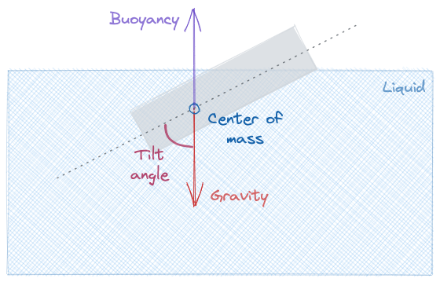
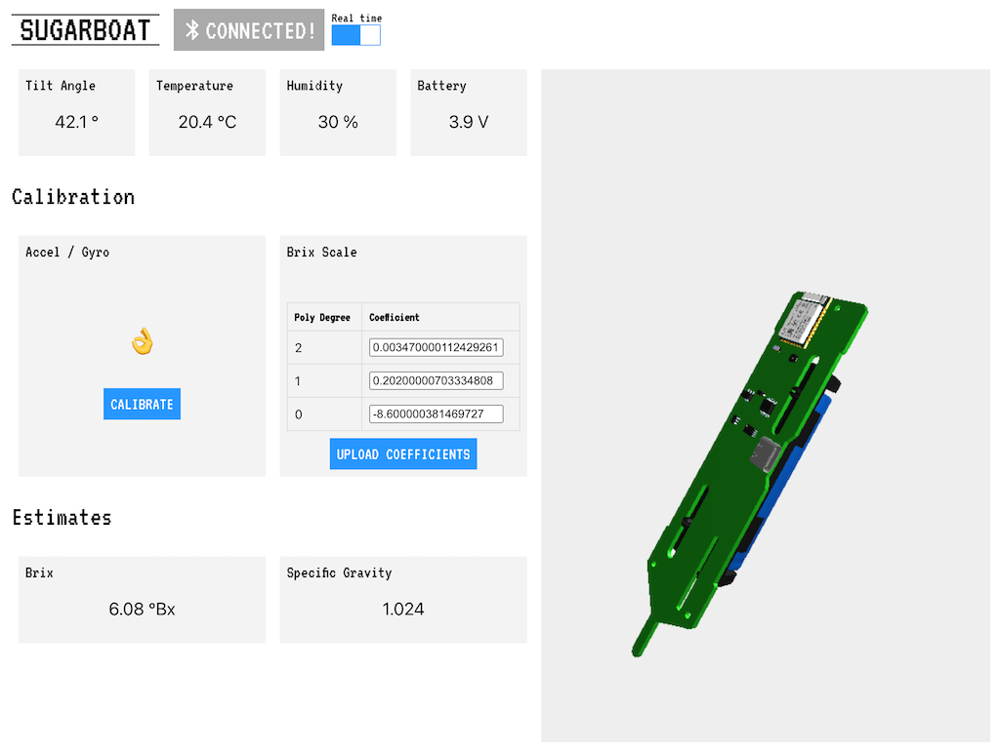

<p align="center" style="background-color: white; padding: 10px">
	
<p>

An open source digital [hydrometer](https://en.wikipedia.org/wiki/Hydrometer). The main use case is measuring the amount of sugar in liquids during the process of beer and wine making.

# How does it work?
Sugarboat floats on top of the liquid being measured. Because of its shifted center of mass, it will float at an angle. This *tilt angle* (see image below) is larger for denser liquids and smaller for less dense liquids. We can then estimate the density of a solution from this angle.

<p align="center">
	
<p>

As is usual in the beer and wine making processes, we can additionally correlate the estimated density of a solution with the amount of sugar present in it.

The estimated [density](https://en.wikipedia.org/wiki/Relative_density) and [sugar content](https://en.wikipedia.org/wiki/Brix) are exposed - along with the temperature, relative humidity, current battery voltage and more - through [Bluetooth Low Energy (BLE)](https://en.wikipedia.org/wiki/Bluetooth_Low_Energy) services. This repository contains examples of how to read these values under [`clients/`](./clients).

# Tech specs
* [nRF52840](https://www.nordicsemi.com/Products/nRF52840) system-on-a-chip
  * Reads sensors, estimates the sugar content and exposes their values via [Bluetooth Low Energy (BLE)](https://en.wikipedia.org/wiki/Bluetooth_Low_Energy) services
* [SHT30](https://www.mouser.com/datasheet/2/682/Sensirion_Humidity_Sensors_SHT3x_Datasheet_digital-971521.pdf) temperature & humidity sensor
* [MPU6050](https://invensense.tdk.com/products/motion-tracking/6-axis/mpu-6050/) accelerometer + gyroscope estimates the tilt angle
* Li-Ion 18650 battery
  * Battery life of over a year on a single charge
  * Built-in [TP4056](http://www.tp4056.com/d/tp4056.pdf)-based charging circuit
* USB-C for battery charging and programming
  * [UF2 support](https://learn.adafruit.com/adafruit-feather-m0-express-designed-for-circuit-python-circuitpython/uf2-bootloader-details) using a [forked Adafruit_nRF52_Bootloader](https://github.com/rbaron/Adafruit_nRF52_Bootloader) allows for direct programming via the USB-C port. This bootloader needs to be flashed to the blank nRF52 chip once using a J-Link or compatible SWD programmer

# Waterproof enclosure
A [preform PET tube (or "petling")](https://en.wikipedia.org/wiki/Polyethylene_terephthalate#Bottle_processing_equipment) is used to enclose the electronics and provide sugarboat with the buoyancy it needs. The printed circuit board is designed to fit tightly into a tube with the inner diameter of around 33 mm and inner height of 123 mm. The board is slightly wider than 33 mm - some light sanding needs to be done to ensure a nice, snuggly fit. I bought my containers from [this eBay offering](https://www.ebay.com/itm/132379354446).

# Repository organization
| Directory                              | Description                                                                                                                              |
|----------------------------------------|------------------------------------------------------------------------------------------------------------------------------------------|
| [`kicad/`](./kicad)                    | Electronics - schematic, PCB layout, bill of materials and fabrication files                                                             |
| [`code/`](./code)                      | Firmware - a [PlatformIO](https://platformio.org/) project using the Arduino framework                                                     |
| [`clients/web/`](./clients/web)         | A web interface for calibrating, configuring and reading sugarboat's sensors                                                             |
| [`clients/arduino/`](./clients/arduino) | A barebones Arduino sketch showing how to read sugarboat's tilt angle, temperature & battery voltage using a Bluetooth Low Energy client |

# Web client

This client is a web page that connects to sugarboat using the [Web Bluetooth API](https://developer.mozilla.org/en-US/docs/Web/API/Web_Bluetooth_API). It lets you calibrate, configure and read the sensor values right from your web browser, wirelessly.

The web client's source code is in [`clients/web/`](./clients/web).

# Calibration
TODO.

# Bootloader flashing
To support programming via the built-in USB-C port (via [UF2](https://github.com/microsoft/uf2)), sugarboat requires a bootloader to be flashed to the chip. This is a one-time operation.

I have [forked the Adafruit nRF52 Bootloader](https://github.com/rbaron/Adafruit_nRF52_Bootloader) and added support to sugarboat. To build and flash the bootloader:

```bash
$ git clone git@github.com:rbaron/Adafruit_nRF52_Bootloader.git
$ cd Adafruit_nRF52_Bootloader/
$ make BOARD=sugarboat all
$ make BOARD=sugarboat flash
```

Note that you will need a SWD programmer to complete this operation. A good choice for hobbyists is a [J-Link EDU Mini](https://www.adafruit.com/product/3571). If you buy one, consider getting it from Adafruit.

# License
The hardware and associated design files are released under the [Creative Commons CC BY-SA 4.0 license](https://creativecommons.org/licenses/by-sa/4.0/).

The code is released under the [MIT license](https://opensource.org/licenses/MIT).